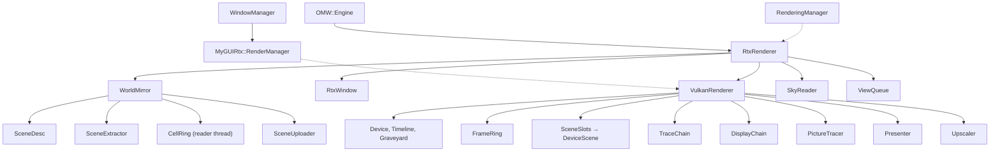

# The ray tracing renderer

How the ray tracer fits into OpenMW: its layers, who owns what, and how a frame is made. This
document describes the shape of the design. The headers hold the detail and the reasons, and a
change that keeps the shape does not change this file.

The tree's own words (walk, stand, hand over, hold, slot, run, ring, epoch) are listed beside the
field's words in [`components/rtx/GLOSSARY.md`](../../components/rtx/GLOSSARY.md).

## 1. What the fork is

Upstream OpenMW stays the host engine: cells, references, physics, scripts, animation, weather,
GUI logic. A second renderer stands beside the OpenGL rasterizer and replaces the whole picture:
primary visibility, shadows, direct and indirect light, sky, water and fog are ray traced. The
rasterizer is not modified. Both renderers stand behind one interface, one binary ships both,
and the one not chosen never starts.

The target is NVIDIA RTX, Turing and later, and AMD RDNA 2 and later, through Vulkan with ray
tracing pipelines and ray queries. The denoiser is the renderer's own, in three parts: a temporal
accumulator and a wavelet over the diffuse light, a port of AMD's FidelityFX Shadow Denoiser over
the sun's and the moons' shadow, and a temporal filter over the glossy light. The upscaler is a
port of AMD's FSR 3.1.4 in compute shaders. At `native` it is the anti-aliasing, and every other
mode traces fewer pixels than the window shows.
Vanilla content is read as it is: its textures are pre-lit, so the renderer estimates the painted
light and divides it out. A PBR replacer's companion maps reach the trace, and a
vanilla scene draws the same whether or not the renderer can read them.

`[RTX] enabled` chooses the renderer. `-DOPENMW_RTX=OFF` builds without it. The player's settings
are in [`rtx.rst`](../source/reference/modding/settings/rtx.rst).

## 2. Layers and libraries

Each layer knows the layer below it and never the one above.

```
apps/openmw                      the game
  │  MWRender::Renderer          the seam          (apps/openmw/mwrender/renderer.hpp)
  ├── GlRenderer                 upstream's rasterizer, gathered behind the seam
  └── RtxRenderer                the game-side owner (apps/openmw/mwrender/rtx/)
        │  Rtx::Renderer         the core's interface to a backend
        ├── components/rtx       the core: what the scene is; no graphics API, no game headers
        └── components/rtxvulkan the backend: everything true of Vulkan

Beside the stack:
  components/myguirtx            MyGUI's backend over Rtx::GuiRenderer
  components/crashcatcher        the fork's crash catcher: a Crashpad monitor process
  apps/rtxtool                   the harness: drives a real game headless
```

A Vulkan fact that reaches `components/rtx` or `apps/openmw` is a bug, and the link lines keep
it out: the core has no Vulkan header on its include path, and the backend links Vulkan
privately. Two places create a backend: `RtxRenderer` and the harness. OpenSceneGraph stays the
content loader whatever draws: the scene arrives as an `osg::Node` graph, and the core reads it.

## 3. The build

`OPENMW_RTX` (on by default) builds the renderer, its tests and the harness.
`components/rtx/build.cmake`
sets the fork's flags (warnings are errors) and adds its directories. Each fork directory lists
its files by hand, and a file that no list names stops the configure.

Shaders are GLSL, compiled by `glslc` and validated by `spirv-val` in one build step, so an
invalid module fails the build. Between the two, `Rtx::pinFloatArithmetic`
(`components/rtxvulkan/spirv/spirvpin.hpp`) fixes the order and fusion of every float operation the
Vulkan specification leaves open, so every compile of a module, the driver's recompiles
included, computes the same frame. The structures both languages read live in
`components/rtx/shaders/*.h`, which compile as C++ and as GLSL.

`./omw [flavour] <verb>` is the one command line over the CMake presets, on the desk and in CI.
`./omw help` lists both.

## 4. The seam: `MWRender::Renderer`

The one interface the game talks to. Read its header first.

- A pure virtual is a question both renderers answer. A default body is an empty answer that one
  renderer has no work for.
- Nothing below the seam is abstracted: contexts, swapchains, render bins and acceleration
  structures belong to one renderer outright.
- The game is never handed one renderer's mechanism. The exceptions are the upstream callers
  that cannot change, and they get null under the ray tracer.
- `createRenderer` throws for a renderer the build lacks. There is no fallback.
- The base keeps what both renderers share: the resource system, the frame clock, the
  screenshot writer, the camera, the traversal root and the view mask.

The game describes each frame as a `SceneFrame` (`sceneframe.hpp`): the scene root, the sky and
weather state, the eye, the water, the ground, in the content's own numbers and undecoded.
`FrameDescriber` collects the fork's per-frame facts so `RenderingManager` stays upstream's.
Pictures taken away from the eye (the local map, the inventory doll, the world map overlay) are
seam types too (`OffscreenView`, `SubjectView`, `MapOverlay`), and each renderer makes them its
own way.

## 5. The game-side owner

`apps/openmw/mwrender/rtx/`. `RtxRenderer` is the ray tracer as the game sees it. There is no
viewer and no cull or draw traversal, because rays go everywhere. It drives each frame itself,
through a phase state machine that every entry point asserts.

- `WorldMirror` mirrors the scene graph into the core's scene description each frame (the walk),
  places the sea, runs the cell ring, and hands the result to the backend.
- `SkyReader` turns the game's sky and weather into the core's `WorldReading`.
- `RippleEmitters` says what disturbs the water, by the rasterizer's own rule.
- `ViewQueue`, `TracedView` and `TracedOverlay` make the pictures inside the interface.
- `TracedGround` is the seam's ground with no chunks: the ray tracer draws terrain itself.
- `classmasks.hpp` is the one mapping from the game's node masks to the ray classes.

**Two hosts, one renderer.** A played session and a harness run reach the renderer through one
record, `RtxSetup` (`rtxrun.hpp`). The host answers per frame what to sample, what to keep and
what to report. A played session installs nothing and gets the played answers.
`RtxSettings::derive` is the one derivation of the ray tracer's settings, and the harness fills
it from its command line. The core reads no settings.

## 6. The interface

MyGUI draws the whole interface, as upstream. Only its backend changes.
`MyGUIPlatform::GuiRenderManager` is the seam into MyGUI, implemented by upstream's OSG manager
and by `MyGUIRtx::RenderManager`, so `WindowManager` never asks which backend it got.

`MyGUIRtx::RenderManager` is written once for every backend. It needs a table of textures and
one call that draws a list of triangles, and that is all it uses of `Rtx::GuiRenderer`. Pictures
the game writes in main memory (the fog of war, the world map, save thumbnails, video frames)
reach the interface through `shareTexture`: the game marks the image dirty, and the backend
sends what changed.

Pictures inside the interface (a map tile, the doll, the race preview) are traced straight into a
GUI texture from a scene of their own, with no reconstruction and no history. With the world
hidden, a frame draws the interface only. The settings pages and the launcher take their menu
orders from the core, and a mode added without a label on each page stops the build.

## 7. The core

`components/rtx/`. What is true of Morrowind's content, of light transport, and of what the
scene is. Written once and read by every backend.

The files stand in folders by what they are for, in an order: a folder includes only the folders
before it, and a folder inside another is a part of it, which the two may both reach into. A
source-tree test holds the order.

| folder              | holds                                                                   |
|---------------------|-------------------------------------------------------------------------|
| `common/`           | what knows no scene: contracts, results, slots, runs, threads, the clock |
| `image/`            | a texture file read: its formats, texels, alpha, levels and painted light |
| `preprocess/`       | `ContentPreprocessor`, its keys, cache and costs; the passes in `shape/` and `texture/` |
| `scene/`            | `SceneDesc`, its rows and tables, and what makes lights and textures of it |
| `frame/`            | what a frame is asked for and sampled with: the camera, the reconstruction |
| `renderer/`         | `Rtx::Renderer` and what it hands, reports and writes                    |
| `mirror/`           | the walk from the scene graph; the cell ring in `cells/`, which runs inside it |
| `environment/`      | the sky, the air and the sea a frame is told                             |
| `view/`             | the pictures traced away from the eye                                    |
| `shaders/`          | the structures C++ and GLSL both read                                    |

- **`Rtx::Renderer`** (`renderer/renderer.hpp`) is one traced image, whichever API makes it. Each
  call is worth a whole scene or a whole frame, never an instance or a pixel: build, extend or
  place a scene; render, collect and present a frame; the reports.
- **`Rtx::SceneDesc`** (`scene/scenedesc.hpp`) is everything a backend needs to know about a world:
  meshes, materials, textures, placements, deformers, and the per-frame lists (lights, sprites,
  emitters, ripples). It appends and deduplicates. A slot is a name and is never renumbered, so a
  hit reads it back as its index. `shaders/scene.h` states the device layout once for both
  languages.
- **`Rtx::SceneExtractor`** mirrors an OSG subtree into a `SceneDesc`. Its identity maps live
  across walks, so an object met again resolves to what was already uploaded, and a still frame
  costs what moved. What a walk did not meet is swept after it.
- **The cell ring** (`mirror/cells/`) stands the world past the loaded cells, because rays reach
  it: the ground from the land records, the statics as instances of their templates, the lamps.
  A reader thread prepares cells, and the frame adopts them a little at a time.
- **`Rtx::ContentPreprocessor`** is the one way anything is computed from what the content files
  hold — a shape's fold and the normals it smoothed across a hard edge split, a texture's alpha and
  mean. One lives on each thread that reads content: the frame's walk and the ring's reader. Every
  pass is keyed on everything it reads and asked of `ContentCache` first; the cache holds nothing
  yet, so every pass runs, and what each costs is counted into the walk's stats and the
  `preprocess` row of a frame.
- **`Rtx::SceneUploader`** hands a scene to the backend once a frame, in the cheapest of three
  ways: place what moved, extend with what arrived, or rebuild.
- **The world a frame is told** (`environment/`) turns a `WorldReading` into the frame's
  constants: sun, moons, sky, clouds, fog, water.
- **Materials.** `ShadingMap` estimates the light painted into a vanilla texture, to divide it
  out. Companion maps (`_n`, `_nh`, `_spec`) and tangents reach the material as data slots. The
  surface model is glTF 2.0's metal-roughness (`shaders/brdf.h`), shared with the host, which
  integrates it once into the table the shader reads for energy compensation. A vanilla surface
  is that model with no specular reflectance.
- **Reconstruction** (`frame/reconstruction.hpp`). `RenderProfile` is what a run decides once.
  `Reconstruction::resolve` is the one rule for everything that follows from how a frame is put
  back together: the denoiser, the jitter, the noise source, the texture level bias.

Content the renderer cannot use is never an assert and never the end of a frame. Readers answer
with a `Rtx::Result`, and every refusal is reported once to `Rtx::Refusals`. A texture that is
refused draws as a stand-in, and anything else refused is left out.

## 8. The backend

`components/rtxvulkan/`. `VulkanRenderer` is `Rtx::Renderer` over Vulkan. Members are declared
in construction order, and everything is built on the device.

The folders keep the core's rule, in this order. `VulkanRenderer` and the owners beside it stand
at the top, over all of them.

| folder              | holds                                                                   |
|---------------------|-------------------------------------------------------------------------|
| `spirv/`            | the pinning and the kernel digest, a library of its own the build runs  |
| `device/`           | the instance, the device, the timeline, the graveyard; `memory/` for buffers and images |
| `pipeline/`         | compute, graphics and ray tracing pipelines, and how a dispatch is sized |
| `texture/`          | the bindless array and the passes a texture is made with as it arrives |
| `scene/`            | `DeviceScene`: its tables, structures, skinning and sprites             |
| `trace/`            | `TraceChain` and its passes, the sea and the fog; the denoiser in `denoise/` |
| `upscale/`          | `Upscaler`: FSR 3.1.4, ported, and `FsrFrame`, its constants            |
| `display/`          | `DisplayChain` and its passes                                           |
| `present/`          | the swapchain and the present                                           |
| `gui/`              | the interface's pass and textures                                       |

- **The device.** `Device` holds the queue, the command pool, the `Timeline` and the
  `Graveyard`. The timeline is the one clock: each submit signals it, each wait is the device's,
  and the host never reads it on the frame path. The graveyard keeps what a submit may still read
  until the timeline passes it. A missing required feature refuses the device, and each optional
  extension is taken whole or not at all.
- **Memory.** What a frame cannot go without is essential and never refused. Content (acceleration
  structures, textures) is taken against the driver's budget and can be refused, and a refusal
  leaves the mesh out or draws the texture's stand-in.
- **`DeviceScene`** is everything one scene is traced against, the world's or a picture's: the
  instance records, the acceleration structures, the buffers a hit reads, the skinning tables and
  the bindless texture array. Each table has one copy per frame slot, and the copy a frame does
  not trace keeps the previous pose for motion vectors.
- **`FrameRing`** keeps two frames in flight. The host places frame N+1 while the device traces
  N.
- **`TraceChain`** is everything one camera's trace writes at one extent: the G-buffer, the fog
  volume, the sprite bins, the denoiser's history. The world has one, and `PictureTracer` has one
  for the pictures inside the interface. The passes are shared.
- **`DisplayChain`** runs after the trace and the upscaler: bloom, exposure, glare, tone, debug
  lines. The GUI draws after it, in display values. The renderer blits to the swapchain and never
  draws into it.
- **`Upscaler`** is FSR 3.1.4's seven passes, from AMD's own headers in `extern/fidelityfx/`, with
  the renderer's callbacks (`shaders/upscale/fsrcallbacks.glsl`). It needs no extension, so it
  runs on every device the renderer does. `FsrFrame` holds its per-frame constants, with no
  device in it. Its reactive and transparency-and-composition masks are the trace's own
  (`CHANNEL_UPSCALE_MASKS`): the share of a pixel's light whose image moves apart from the pixel's
  motion vector — the see-through layers', and what the water's rays show.
- **The denoiser** (`trace/denoise/`) runs where the frame is filtered. The accumulator averages
  the diffuse light over time and the wavelet spreads it across the screen. The shadow denoiser
  filters the one bit a pixel's sun ray came back with, where the sky has a source that lights.
  The glossy filter averages the lobe's light over time, where the scene wears a map. The pane
  filter averages what was drawn for the see-through layers over time, against a history of the
  nearest layer's own surface and motion. The accumulator, the shadow denoiser and the glossy filter
  read one surface history, the accumulator's.

**The shaders** (`shaders/`, in the folders of the passes that dispatch them, shared pieces in
`shaders/lib/`). One ray generation shader traces
one ray per pixel and composes the path. Closest-hit shaders are picked by the shader table per
material kind. Secondary visibility in a hit uses ray queries. The rest are compute passes: the
fog, the sprites, the denoiser, the composite, the display chain, skinning, texture preparation,
the sea and the ripples. Specialization constants, not branches, remove what a frame cannot use
(`lib/variants.glsl`).

## 9. Ownership



Solid arrows own, dashed arrows borrow. `RtxRenderer` outlives the world: `attachWorld` and
`detachWorld` are a pair inside it. The pictures inside the interface are owned by the game's map
and preview, and they leave the queue when they go.

## 10. A frame

On the host, in order:

1. The engine's loop runs input, simulation and the update traversal as upstream. The game
   describes the frame.
2. **Walk.** `WorldMirror` mirrors the graph into the `SceneDesc`, the cell ring collects what its
   thread read, and the sweep drops what the walk did not meet.
3. **Hand over.** The frame before last is collected where the ring is full. `SceneUploader`
   places, extends or rebuilds the backend's scene.
4. **Views.** Queued pictures inside the interface are traced.
5. **Trace.** The camera and the world are turned into the frame's constants, and the backend
   records the frame.
6. **GUI and present.** The host returns without waiting for the device.

On the device, in record order: the sea and the ripples, the sprites, the fog, the trace, the
denoiser where it runs (the accumulator, the shadow denoiser, the glossy filter, the pane filter, the
wavelet), the
composite where a denoiser or a sum needs one, the upscaler where one runs, the display chain, the
GUI, the present.

Four clocks drive a frame, each with one source: host time (the wall in play, the frame count
times a stated step in a measured run), simulation time, game time (the hour), and the sky's
clock. The wall is read only to measure. A cut (a teleport, a worldspace change, a time skip)
resets every history. A setting that changes the extent or the upscaler takes effect at once.

## 11. Threads

- **The main thread** makes every seam call, every walk, every submit and every wait.
- **The cell reader** (`CellSupply`) reads cells and lends their models and images to the frame.
- **The launch compile** (`VisibilityPass`) builds the ray tracing pipelines from construction.
  Loading waits for it behind a "Compiling Shaders" step.
- **The driver** recompiles launches on its own threads. The pinned arithmetic makes both codes
  trace the same frame.

`OwnedBy` asserts which thread owns a member. A worker that throws ends the process where it
threw, and the crash report keeps its stack.

## 12. Contracts

The code asserts the order of its steps (`Rtx::Stepped`, the phase machine), which thread owns
what, at most two frames in flight, that nothing joins a per-frame list after the hand-over, that
every hold and slot is counted, and that descriptor bindings follow the names their shared header
declares.

Data the world supplies is never an assert. Configuration or an installation the renderer cannot
run with throws `Rtx::InputError`. A missing device feature throws `Rtx::Unsupported`. A device
that refuses throws `Rtx::DeviceError`. A lost device or a wait that never ends crashes where it
was found, so the crash report shows it.

## 13. Harness and tests

`openmw-rtxtool` drives a real game headless: `info`, `scene`, `shot`, `view`, `bench`, `check`,
`film`. `RtxTool::Session` is both the engine's host and the renderer's run. It places the world
where a stop stands, moves the camera a frame at a time, holds the clock and the weather, and
measures each frame. What a verb does with a place is one row of `VerbPolicy` (`verbs.hpp`). The
instruments (`apps/rtxtool/instruments/`) measure frames and know nothing of a world. The model
(`apps/rtxtool/model/`) is what a run visits and what it recorded.

| binary             | holds                                                          |
|--------------------|----------------------------------------------------------------|
| `components-tests` | the core, the harness's parsing, the crash notes; any machine    |
| `openmw-tests`     | the game side: the renderer, the mirror, the terrain              |
| `rtx-gpu-tests`    | what opens a device; fails without one                           |
| `crash-tests`      | every way a game ends, and the report the catcher left           |

Rendering changes are checked without a window. `AGENTS.md` lists the commands.

## 14. Where to look

| to know                                   | open                                                                                  |
|-------------------------------------------|---------------------------------------------------------------------------------------|
| what the game asks of a renderer          | `apps/openmw/mwrender/renderer.hpp`, `sceneframe.hpp`                                  |
| how the ray tracer answers it             | `apps/openmw/mwrender/rtx/rtxrenderer.hpp`                                             |
| the walk, the sweep, the hand-over        | `mwrender/rtx/worldmirror.hpp`, `components/rtx/mirror/sceneextractor.hpp`, `components/rtx/renderer/sceneuploader.hpp` |
| what the scene is                         | `components/rtx/scene/scenedesc.hpp`                                                   |
| the cells past the active grid            | `components/rtx/mirror/cells/cellring.hpp`                                             |
| what is computed from content, and cached | `components/rtx/preprocess/contentpreprocessor.hpp`, `contentpass.hpp`                 |
| the sky, the air and the sea              | `components/rtx/environment/frameworld.hpp`, `mwrender/rtx/skyreader.hpp`              |
| the surface model                         | `components/rtx/shaders/brdf.h`                                                        |
| what a frame is on the device             | `components/rtx/shaders/visibility.h`, `scene.h`                                       |
| the backend's frame                       | `components/rtxvulkan/vulkanrenderer.hpp`, `trace/tracechain.hpp`, `display/displaychain.hpp` |
| a scene on the device                     | `components/rtxvulkan/scene/devicescene.hpp`                                           |
| the light transport                       | `components/rtxvulkan/shaders/trace/visibility.rgen`, `lib/`                           |
| the denoiser and the upscaler             | `components/rtx/frame/reconstruction.hpp`, `components/rtxvulkan/trace/tracechain.hpp`, `components/rtxvulkan/upscale/upscaler.hpp` |
| the GUI                                   | `components/myguirtx/rendermanager.hpp`, `components/rtx/renderer/guirenderer.hpp`     |
| the two hosts                             | `mwrender/rtx/rtxrun.hpp`, `apps/rtxtool/session.hpp`                                  |
| the pinned arithmetic                     | `components/rtxvulkan/spirv/spirvpin.hpp`                                              |
| the build                                 | `components/rtx/build.cmake`, `CMakePresets.json`, `tools/omw`                         |
